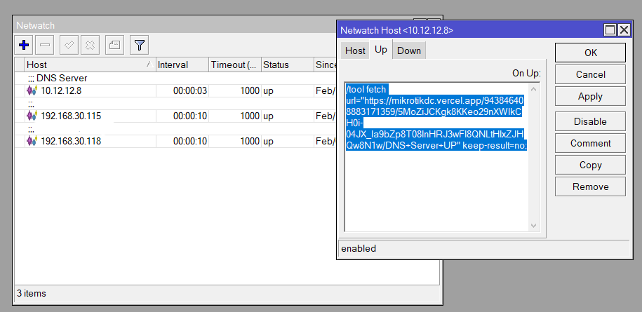

# Mikrotik Notif Discord

Monitor your Mikrotik devices for sending logs from hostpot/vpn/pppoe/netwatch/etc to your discord.

## How To Use

- Copy this script to your Mikrotik, for example in Netwatch

```bash
/tool fetch url="https://mikrotikdc.vercel.app/[ID_WEBHOOK_DISCORD]/[TOKEN_WEBHOOK_DISCORD]/[YOUR_TEXT]" keep-result=no;
```

- Example discord webhook url.
  `https://discordapp.com/api/webhooks/943846408883171359/5MoZiJCKgk8KKeo29nXWIkCH0i-04JX_la9bZp8T08InHRJ3wFI8QNLtHIxZJHQw8N1w`

- Notes
  - `ID_WEBHOOK_DISCORD` change to your id discord webhook url, example `943846408883171359`
  - `TOKEN_WEBHOOK_DISCORD` change to your token discord webhook url, example `5MoZiJCKgk8KKeo29nXWIkCH0i-04JX_la9bZp8T08InHRJ3wFI8QNLtHIxZJHQw8N1w`
  - `YOUR_TEXT` you need to change to whatever you want. For spacing use `+`, example `Network+Is+UP`


